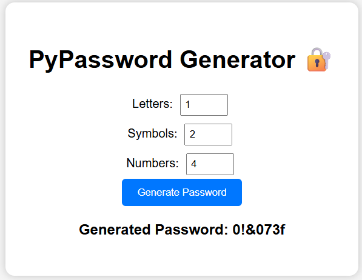

# 🔐 PyPassword Generator – Web App

A simple and stylish web-based Password Generator built with **Python (Flask)** and a beautiful **HTML/CSS/JavaScript** frontend.  
Customize how many letters, symbols, and numbers you want — and instantly generate a secure password.




---

## 🚀 Features

- 🧠 Choose number of **letters**, **symbols**, and **numbers**
- ⚡ Real-time password generation
- 🎨 Smooth animations and modern design
- ✅ Simple to use and beginner-friendly
- 📦 Powered by Python & Flask

---

## 🖥️ Demo

Try it locally:

```bash
git clone https://github.com/yourusername/password-generator-web.git
cd password-generator-web
pip install flask
python app.py
Then open http://127.0.0.1:5000 in your browser.

📸 Screenshots
Homepage	Generated Password

🛠️ Built With
Python
Flask
HTML5
CSS3
JavaScript

📂 Project Structure

password-generator-web/
├── app.py
├── static/
│   ├── style.css
│   └── script.js
├── templates/
│   └── index.html
└── README.md

💡 Future Improvements
🔐 Add password strength indicator

📋 Add "Copy to Clipboard" button

🌙 Add dark mode toggle

☁️ Deploy online using Render or Replit

🤝 Contributing
Contributions, issues, and feature requests are welcome!
Feel free to fork the repo and submit a PR.

📜 License
This project is open source and available under the MIT License.

🙋‍♂️ Author
Ravi Saha
📧 uic.23mca20318@gmail.com
🌐 https://github.com/Mr-J02

⭐ If you like this project, give it a star on GitHub!